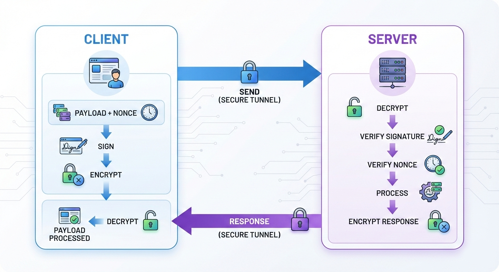

# TransENC

**TransENC** is a secure encrypted transport library for Laravel that implements hybrid encryption (AES + RSA), payload signing, and anti-replay attack protection (nonce) for secure API communication between client and server.

## Features

* AES-256-GCM for payload encryption
* RSA-2048 / RSA-4096 for key exchange
* Payload signing for integrity & authentication (HMAC SHA256)
* Replay attack protection using nonce (auto generated & validated)
* Automatic payload encryption/decryption + nonce/signature management
* Artisan commands for key lifecycle management
* Fully integrated with Laravel Service Container



## Requirements

* PHP >= 8.1
* Laravel >= 10
* OpenSSL extension enabled

## Installation

### Install via Packagist (Recommended)

```bash
composer require fhylabs/transenc
```

### Install via Local Path

Add a path repository to `composer.json`:

```json
"repositories": [
    {
        "type": "path",
        "url": "TransENC",
        "options": {
            "symlink": true
        }
    }
]
```

Require the package:

```bash
composer require fhylabs/transenc:@dev
```

## Publish Config

```bash
php artisan vendor:publish --provider="TransENC\Providers\EncryptedTransportServiceProvider" --tag=config
```

The config file will be available at:

```bash
config/encrypted_transport.php
```

## Key Management

### Generate keys for a client

```bash
php artisan transenc:generate-key testclient
```

Generates:

* RSA private key (server)
* RSA public key (client)
* Client-isolated key storage

### Rotate keys

```bash
php artisan transenc:rotate-keys
```

> Old keys remain valid during the grace period (configurable).

### Encrypt Payload (CLI)

```bash
php artisan transenc:encrypt-payload testclient '{"foo":"bar"}'
```

---

## API Reference

### Encryption Service

| Method    | Parameters                                              | Return   | Description                                                                                                                                      |
| --------- | ------------------------------------------------------- | -------- | ------------------------------------------------------------------------------------------------------------------------------------------------ |
| `encrypt` | `string $payload`<br>`string $clientId = null`          | `string` | Encrypts JSON payload using **AES-GCM** and secures the key with the client **RSA public key**. Automatically attaches nonce and HMAC signature. |
| `decrypt` | `string $encryptedPayload`<br>`string $clientId = null` | `string` | Decrypts the payload using the server **RSA private key**, validates AES payload, HMAC signature, and nonce.                                     |

### Payload Signer

| Method   | Parameters                                                     | Return   | Description                                                              |
| -------- | -------------------------------------------------------------- | -------- | ------------------------------------------------------------------------ |
| `sign`   | `string $payload`<br>`string $clientId`                        | `string` | Creates a signature to ensure **payload integrity**                      |
| `verify` | `string $payload`<br>`string $signature`<br>`string $clientId` | `bool`   | Verifies that the payload was not modified and comes from a valid client |

### Nonce Manager

| Method     | Parameters         | Return   | Description                                                     |
| ---------- | ------------------ | -------- | --------------------------------------------------------------- |
| `generate` | `int $length = 16` | `string` | Generates a secure nonce for replay protection                  |
| `verify`   | `string $nonce`    | `bool`   | Ensures a nonce is used **only once** to prevent replay attacks |

### Artisan Commands

| Command                    | Arguments           | Description                        |
| -------------------------- | ------------------- | ---------------------------------- |
| `transenc:generate-key`    | `{clientId}`        | Generate RSA key pair for a client |
| `transenc:rotate-keys`     | –                   | Securely rotate encryption keys    |
| `transenc:encrypt-payload` | `{clientId} {json}` | Test payload encryption via CLI    |

---

## Example of Use

#### Server Side (Laravel Controller / Route)

```php
use TransENC\Services\EncryptionService;

$encryptor = app(EncryptionService::class);

/*
|--------------------------------------------------------------------------
| 1. Decrypt Incoming Payload
|    (auto validates nonce & signature)
|--------------------------------------------------------------------------
*/
$payload = json_decode($encryptor->decrypt($encryptedPayload), true);

/*
|--------------------------------------------------------------------------
| 2. Prepare Response
|--------------------------------------------------------------------------
*/
$response = [
    'status' => 'success',
    'data'   => $payload,
];

return $encryptor->encrypt(json_encode($response));
```

#### Client Side

```php
use TransENC\Services\EncryptionService;

$encryptor = app(EncryptionService::class);

/*
|--------------------------------------------------------------------------
| 1. Prepare Payload
|    (nonce and signature auto-generated)
|--------------------------------------------------------------------------
*/
$payload = [
    'name' => 'FHY',
    'role' => 'admin',
    'time' => time(),
];

$encryptedPayload = $encryptor->encrypt(json_encode($payload));

/*
|--------------------------------------------------------------------------
| 2. Send Request
|--------------------------------------------------------------------------
*/
$request = [
    'client_id' => 'testclient',
    'payload'   => $encryptedPayload,
];

/*
|--------------------------------------------------------------------------
| 3. Receive & Decrypt Response
|--------------------------------------------------------------------------
*/
$response = json_decode($encryptor->decrypt($encryptedResponse), true);
```

> Developer **does not need to manage nonce or signature manually**. Everything is handled automatically by the library.

---

## Folder Structure

```bash
TransENC/
│
├── src/
│   ├── Console/
│   │   ├── GenerateClientKey.php
│   │   ├── RotateKeys.php
│   │   └── EncryptPayload.php
│   │
│   ├── Config/
│   │   └── encrypted_transport.php
│   │
│   ├── Exceptions/
│   │   ├── DecryptionException.php
│   │   └── EncryptionException.php
│   │
│   ├── Http/
│   │   └── Middleware/
│   │       ├── DecryptRequest.php
│   │       └── EncryptResponse.php
│   │
│   ├── Services/
│   │   ├── EncryptionService.php
│   │   ├── KeyManager.php
│   │   ├── PayloadSigner.php
│   │   └── NonceManager.php
│   │
│   ├── Support/
│   │   └── PayloadHelper.php
│   │
│   ├── Providers/
│   │   └── EncryptedTransportServiceProvider.php
│   │
│   └── Traits/
│       └── Encryptable.php
│
└── composer.json
```

---

## Best Practices for Production

This section explains **best practices** when using **TransENC** in production or enterprise environments.
Following this guide ensures **confidentiality, integrity, replay protection (nonce), and operational security**.

#### Always Use HTTPS (TLS)

Even though TransENC provides **payload encryption**, **HTTPS must still be used**.

**Reasons:**

* Prevents traffic metadata leakage
* Protects against downgrade or routing attacks
* Secures authentication headers and routing information

> TransENC **complements TLS**, it does not replace it.

#### Protect Server Private Keys

The server RSA private key is the **root of trust**.

**Recommended practices:**

* Store keys outside the public directory
* Restrict file permissions:

  ```bash
  chmod 600 storage/transenc/keys/*.pem
  ```
* Do not commit keys to version control
* Use separate keys for dev / staging / prod

#### Enable Key Rotation

Key rotation limits the impact if a key is compromised.

Recommended configuration:

```php
'key_rotation' => [
    'enabled' => true,
    'grace_period' => 3600, // 1 hour
],
```

**Mechanism:**

* New keys are used for encryption
* Old keys remain valid for decryption during the grace period
* No downtime during rotation

#### Do Not Disable Nonce Validation

Nonce validation protects against **replay attacks**, critical for:

* Financial transactions
* Payment systems
* Authentication APIs

**Best practices:**

* Each request must have a unique nonce
* Nonce storage must be atomic (Redis SETNX / DB unique index)
* Short TTL is recommended (2–5 minutes)

> Disabling nonce in production is **strongly discouraged**.

#### Do Not Log Plaintext Payloads

Avoid logging:

* Decrypted payloads
* AES / RSA private keys
* Signatures related to plaintext

**Safe logging:**

* Client ID
* Request ID
* Timestamp
* Encryption metadata (without payload)

Example:

```text
[OK] Encrypted request received from client=testclient
```

#### Treat Decryption Failures as Security Events

`DecryptionException` may indicate:

* Manipulated payload
* Invalid signature
* Replay attack
* Wrong client key

**Recommended actions:**

* Return generic error messages
* Log events internally
* Do not disclose cryptographic details to the client

#### Separate Client and Server Keys

Each client **must have its own key pair**.

**Do not:**

* Share keys between clients
* Use the same key across different environments
* Allow clients to upload their own private keys

Benefits:

* Client isolation
* Limits compromise impact
* Easier key revocation

#### Validate Business Logic After Decryption

TransENC only secures **transport and integrity**, not business rules.

Always validate:

* Transaction amounts
* User access rights
* Idempotency keys
* Request timestamps

Security ≠ business correctness.

#### Use Middleware for Consistency

For APIs, use:

* `DecryptRequest` middleware
* `EncryptResponse` middleware

Benefits:

* Consistent encryption enforcement
* Reduces developer mistakes
* Centralizes security logic

#### Separate Environments

Always separate:

* Keys
* Client IDs
* Configurations

Across environments:

* Local
* Staging
* Production

Do not use production keys in other environments.

#### Security Model Summary

| Layer       | Responsibility                 |
| ----------- | ------------------------------ |
| TLS         | Network security               |
| TransENC    | Payload encryption & integrity |
| Nonce       | Replay protection              |
| Application | Authorization & business logic |

TransENC follows **defense-in-depth**, meaning security does not rely on a single layer.